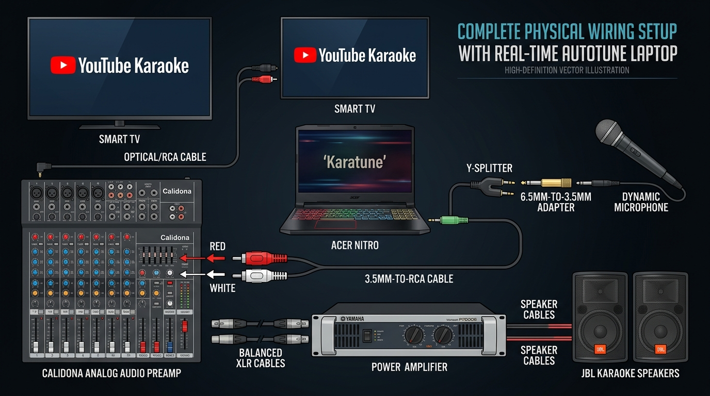
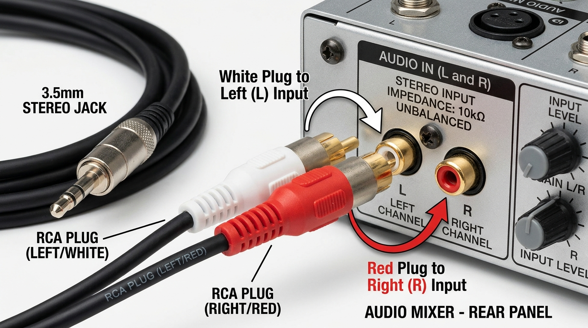

# 01. Phân Tích Phần Cứng Thực Tế & Hướng Dẫn Đấu Nối Âm Thanh (Audio I/O)

Tài liệu này được cập nhật chính xác theo **dàn thiết bị âm thanh thực tế tại nhà của bạn** (đã xác thực qua hình ảnh hệ thống), hướng dẫn những phụ kiện cần mua và cách cắm dây chuẩn xác nhất để vừa hát karaoke hay, vừa tận dụng được phần mềm AutoTune thời gian thực.

---

## 1. Danh sách thiết bị hiện có tại nhà của bạn

| STT | Thiết bị | Tên thiết bị / Model | Vai trò trong hệ thống |
|:---:|:---|:---|:---|
| 1 | **Máy tính xử lý** | Laptop Acer Nitro 5 | Chạy phần mềm `karatune.exe` (AutoTune bẻ nốt thời gian thực) và phát nhạc beat karaoke Youtube. |
| 2 | **Bộ tiền khuếch đại (Mixer)** | **Vang cơ Calidona Audio P828** *(Stereo Mixing Digital Echo)* | Nhận tín hiệu Micro, hòa trộn tiếng nhạc, xử lý hiệu ứng vang nhại (Digital Echo / Repeat / Delay). |
| 3 | **Cục đẩy công suất** | **YAMAHA P7000S** *(Power Amplifier)* | Khuếch đại công suất cực lớn để kéo dàn loa ngoài. |
| 4 | **Hệ thống loa chính** | **Cặp loa JBL gia đình** | Phát âm thanh karaoke với công suất mạnh mẽ, âm bass uy lực và độ nhạy cao. |
| 5 | **Micro thu âm** | **Micro dây karaoke (Jack 6.5mm to)** | Micro dynamic có dây, độ bền cao, chống hú tốt. |

---

## 2. Bạn cần mua thêm những gì?

### Phương án TỐI ƯU & TIẾT KIỆM NHẤT: Tận dụng trực tiếp Laptop (Chỉ ~70.000đ - 90.000đ)
> **Khuyên dùng:** Không cần mua Soundcard rời 500.000đ vì gây lãng phí và trùng lặp tính năng! Nhà bạn đã có Vang cơ Calidona P828 chỉnh Echo/Bass/Treble cực hay, và Laptop Nitro 5 đã chạy phần mềm `karatune.exe` xử lý AutoTune thời gian thực siêu mượt (<5.3ms).

*Tổng chi phí: **~70.000đ - 90.000đ** (rẻ hơn 5-6 lần so với mua Soundcard)*

| Phụ kiện cần mua | Tác dụng | Giá tham khảo | Link tìm kiếm Shopee |
|:---|:---|:---:|:---:|
| **1. Cáp chia tai nghe & mic 3.5mm (Y-Splitter)**<br>*(Hoặc củ USB Soundcard mini)* | Cắm vào jack 3.5mm (hoặc cổng USB) của Laptop để tách riêng 1 cổng Mic In và 1 cổng Loa Out. | ~25.000đ - 45.000đ | [Cáp chia tai nghe & mic 3.5mm](https://shopee.vn/search?keyword=cap%20chia%20tai%20nghe%20va%20mic%203.5mm) hoặc [USB Sound Card mini 7.1](https://shopee.vn/search?keyword=usb%20sound%20card%207.1) |
| **2. Đầu chuyển Jack 6.5mm (cái) sang 3.5mm (đực)** | Cắm chân to 6.5mm của Micro dây vào lỗ Micro 3.5mm của cáp chia. | ~10.000đ - 15.000đ | [Jack chuyển 6.5 sang 3.5](https://shopee.vn/search?keyword=jack%20chuyen%206.5%20sang%203.5) |
| **3. Dây 3.5mm ra 2 đầu hoa sen (RCA)** | Dẫn tiếng hát AutoTune từ cổng Loa của cáp chia vào cổng VIDEO (Audio In) sau Vang cơ Calidona. | ~25.000đ - 35.000đ | [Dây 3.5 ra RCA hoa sen](https://shopee.vn/search?keyword=day%203.5%20ra%20hoa%20sen%20rca) |

---

### Khi nào mới cần Soundcard rời? (Không khuyến khích)
Các loại Soundcard livestream ngoài thị trường (như K300, XOX K10, Icon Upod) thường có giá từ 300.000đ đến hơn 500.000đ - 1.000.000đ. Chúng chỉ thực sự cần thiết nếu bạn livestream trên điện thoại hoặc dùng mic thu âm condenser 48V. Với dàn karaoke gia đình đã có sẵn Vang cơ Calidona + Loa JBL, việc bỏ ra 500k mua Soundcard là **hoàn toàn không cần thiết**.

---

### Lưu ý đặc biệt về nguồn nhạc Beat Karaoke từ Smart Tivi:
Nhà bạn đã có **Màn hình Tivi kết nối trực tiếp Youtube**, điều này giúp hệ thống càng tối ưu và chuyên nghiệp hơn:
- **Tivi phát nhạc Beat Youtube:** Xuất âm thanh từ Tivi xuống cổng **TAPE** (hoặc Optical/Bluetooth) ở mặt sau Vang cơ Calidona P828.
- **Laptop Acer Nitro 5:** Đóng vai trò là **Bộ xử lý giọng hát (Vocal Processor)** độc lập, chạy phần mềm `karatune.exe` để bẻ nốt AutoTune rồi xuất vào cổng **VIDEO** của Vang cơ.
- **Vang cơ Calidona P828:** Hòa trộn nhạc Beat từ Tivi với giọng hát AutoTune từ Laptop, đẩy xuống Cục đẩy Yamaha P7000S và phát ra Loa JBL. Laptop không cần tải video Youtube, dành 100% tài nguyên CPU để xử lý AutoTune với độ trễ tối thiểu!

---

## 3. Sơ đồ đấu nối chi tiết (Tiết kiệm nhất & Khuyên dùng)



### Chi tiết cách cắm Jack Hoa Sen (RCA Trắng / Đỏ):


[SMART TIVI (Phát Youtube Beat)]
       │
       ▼ (Dây Optical / Bluetooth hoặc Dây hoa sen RCA)
       │ (Cắm vào cổng TAPE ở mặt sau Vang cơ)
       │
       ├─────────────────────────────────────────────────┐
       │                                                 ▼
[Micro Dây (Jack 6.5mm)]                        [VANG CƠ Calidona P828]
       │                                                 ▲
       ▼ [Đầu chuyển 6.5mm sang 3.5mm]                   │ (Cắm vào cổng VIDEO Audio IN)
       │                                                 │
       ▼ (Cắm vào lỗ MIC của Cáp chia)                   │ [Dây 3.5mm ra 2 đầu Hoa Sen RCA]
[CÁP CHIA Y-SPLITTER 3.5MM (hoặc USB Sound mini)]        │
       ▲                                                 │
       │ (Cắm vào jack 3.5mm hoặc cổng USB của Laptop)   │
[LAPTOP NITRO 5 (Chạy 'karatune.exe')] ──────────────────┘
  - Nhận giọng mộc qua WASAPI (<5.3ms)
  - Xử lý AutoTune thời gian thực
  - Xuất giọng hát đã bẻ nốt qua cổng Loa
                                                         │
                                                         ▼ (Dây Canon XLR / RCA Out)
                                                [CỤC ĐẨY YAMAHA P7000S]
                                                         │
                                                         ▼ (Dây Speakon)
```

---

## 4. Hướng dẫn các nút gạt & cân chỉnh trên dàn máy

1. **Trên Vang cơ Calidona Audio P828:**
   - **Nút chọn nguồn (SELECT):** Nhấn nhả nút **TAPE / VIDEO** ở mặt trước cho đúng với cổng bạn cắm dây hoa sen ở mặt sau.
   - **Music Control:** Vặn nút `VOL` ở mức 40% - 50%, `LOW` (Bass) ở hướng 12h, `MID` hướng 11h, `HIGH` (Treble) hướng 1h để nhạc sáng rõ lời.
   - **Echo Control:** Nếu bạn đã bật AutoTune trên máy tính, hãy để `ECHO VOL` ở mức vừa phải (hướng 10h - 11h) để không bị nhại quá nhiều làm mờ hiệu ứng bẻ nốt.
2. **Trên Cục đẩy Yamaha P7000S:**
   - Vặn 2 núm volume kênh A và kênh B ở mức **hướng 12h đến 2h** (tùy độ to của phòng khách).
   - Đảm bảo đèn `PROTECTION` tắt và đèn `POWER` màu xanh sáng.
3. **Trên phần mềm `karatune.exe`:**
   - Mở phần mềm lên, chọn chế độ Thang âm và Tốc độ phù hợp.
   - Khi cất tiếng hát, âm thanh sẽ đi qua chuỗi AutoTune bẻ nốt mượt mà, truyền vào Vang cơ Calidona, khuếch đại qua Cục đẩy Yamaha và bùng nổ trên cặp loa JBL!

---

## 5. Cẩm nang tối ưu âm thanh & Khắc phục lỗi thường gặp khi hát thực tế

### A. Khắc phục lỗi âm lượng bị dập dềnh "to nhỏ to nhỏ" khi ngân giọng
- **Nguyên nhân:** Windows 11 mặc định kích hoạt tính năng **Audio Enhancements (Lọc ồn AI) và AGC (Tự động tăng giảm âm lượng)**. Khi bạn ngân một hơi dài, Windows tưởng là tiếng ồn máy quạt nên tự bóp nhỏ âm lượng xuống, sau đó lại tự kéo to lên tạo cảm giác bị "bơm thụt / thở âm".
- **Cách xử lý triệt để (Tắt Audio Enhancements):**
  1. Chuột phải vào biểu tượng **Loa** ở góc dưới cùng bên phải màn hình $\rightarrow$ chọn **Sound settings (Cài đặt âm thanh)**.
  2. Cuộn xuống phần **Input (Đầu vào)** $\rightarrow$ click vào thiết bị micro đang dùng (ví dụ: *Microphone Array* hoặc *Microphone Realtek*).
  3. Tìm đến dòng **Audio enhancements (Cải thiện âm thanh)** $\rightarrow$ chuyển sang **Off (Tắt)**.
  4. Lúc này mic sẽ thu mộc nguyên bản, tiếng ngân sẽ đều tăm tắp, không bị to nhỏ thất thường nữa.

---

### B. Khắc phục cảm giác giọng bị "Robot điện tử"
- **Nguyên nhân:** Nút **TỐC ĐỘ** trên giao diện đang để ở mức **`NHANH (0 MS) - RAP`**. Tốc độ 0ms (Hard Tune) là chế độ cố tình bẻ nốt giật gấp kiểu ca sĩ T-Pain hay rapper Hieuthuhai, nó triệt tiêu toàn bộ độ rung tự nhiên của cổ họng người.
- **Cách chỉnh để giọng người thật tự nhiên 100%:**
  - Click vào nút tốc độ để chuyển sang: **`TỐC ĐỘ: TỰ NHIÊN (50 MS)`** (hoặc `TỐC ĐỘ: VỪA (25 MS) - POP`).
  - Ở mức 50ms, phần mềm giữ nguyên 100% độ luyến láy và rung giọng thật của bạn, chỉ nắn các nốt bị phô/lệch tông về nốt chuẩn một cách êm ái, biến mất hoàn toàn cảm giác robot!

---

### C. Sự khác biệt giữa Mic Laptop và Micro Dây Karaoke Thật
- **Mic Laptop (Màng thu 2mm Omni):** Thu đa hướng 360 độ từ khắp phòng, thu cả tiếng quạt gió máy tính Nitro 5 và tiếng ồn tường, dải tần hẹp, âm thanh mỏng và khô.
- **Micro Dây Thật (Củ Dynamic 30mm Cardioid):** Chỉ bắt âm thanh ở cự ly 1 – 3cm ngay sát miệng. Tiếng ồn phòng và tiếng quạt bị màng rung vật lý triệt tiêu đến 85%. Tiếng hát có dải trầm ấm, dày dặn, áp lực âm thanh mạnh.
- **Lưu ý:** Khi cắm Mic dây thật vào máy tính, **tuyệt đối KHÔNG BẬT Audio Enhancements của Windows** vì mic thật đã tự chống ồn vật lý rất tốt, bật lọc AI của Windows sẽ làm méo giọng và tăng độ trễ (delay).

---

### D. Hướng dẫn chọn Tông bài hát (Key / Scale) thông minh
1. **Chế độ tự động toàn năng: `12 BÁN ÂM (CHROMATIC)` (Khuyên dùng):**
   - Chứa đầy đủ 12 nửa cung (C, C#, D, D#, E, F, F#, G, G#, A, A#, B).
   - Hát bất kỳ bài nào, vào bất kỳ nốt nào cũng tự động nắn về nốt chuẩn gần nhất mà không cần bạn phải biết bài đó ở tone gì.
2. **Chế độ khóa Tone chuẩn:**
   - Hầu hết các bài hát Karaoke trên YouTube đều ghi sẵn TONE ngay trên tựa đề hoặc video mở đầu (Ví dụ: *Tone Nam Am*, *Tone Nữ C*).
   - Bạn chỉ cần click chọn đúng `LA THỨ (Am)` hoặc `ĐÔ TRƯỞNG (C)` trên phần mềm để thuật toán bẻ nốt chuẩn xác và gắt hơn nữa.

---

### E. So sánh 2 phương án nguồn phát YouTube

| Tiêu chí | Phương án 1: Phát YouTube trên Smart TV | Phương án 2: Phát YouTube trên Laptop (Khuyên dùng) |
|:---|:---|:---|
| **Cách kết nối** | TV tự mở YouTube $\rightarrow$ kéo dây âm thanh từ TV vào cổng TAPE của Vang cơ. | Mở YouTube trên Laptop $\rightarrow$ cắm 1 dây HDMI lên TV để chiếu chữ to. |
| **Đường dây âm thanh** | Phải đi thêm dây âm thanh từ TV xuống Vang cơ. | **Gọn nhất:** Laptop xuất 1 đường âm thanh duy nhất (gộp cả Nhạc Beat + Giọng AutoTune) xuống Vang cơ. |
| **Tìm kiếm bài hát** | Bấm từng chữ bằng remote TV (chậm). | Gõ bàn phím laptop chọn bài cực nhanh (gấp 10 lần). |
| **Nhận diện Tông bài** | Không phân tích được beat từ TV. | Dễ dàng nhìn thấy ngay tựa đề Tone Nam/Nữ để chọn trên Karatune. |

