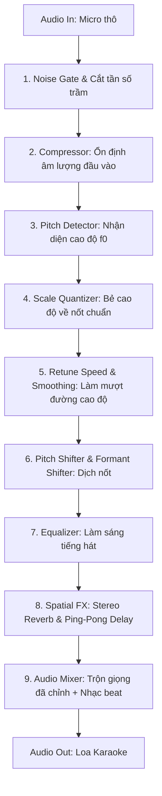

# 02. Chuỗi Xử Lý Tín Hiệu Âm Thanh (Core DSP Pipeline)

Tài liệu này giải thích chi tiết nguyên lý hoạt động và toán học đằng sau chuỗi xử lý tín hiệu số (DSP - Digital Signal Processing) của phần mềm AutoTune thời gian thực.

---

## 1. Sơ đồ tổng thể luồng âm thanh (Audio Processing Graph)

Mỗi khối dữ liệu âm thanh (Audio Block/Buffer, ví dụ 128 samples tại 48kHz) sẽ đi qua quy trình tuần tự sau:

---

## 2. Các giai đoạn xử lý cốt lõi

### Bước 1: Tiền xử lý (Pre-Processing)
1. **High-Pass Filter (Low-Cut 80Hz - 100Hz):**
   - Loại bỏ tạp âm tần số siêu thấp (tiếng thở phì phò, tiếng rung mic, tiếng ù điện 50Hz).
   - Bộ lọc Butterworth bậc 2 (12dB/octave).
2. **Noise Gate:**
   - Khi ca sĩ không hát, cổng âm thanh đóng lại để loa hoàn toàn tĩnh, không bị xì xoẹt hay bắt tiếng ồn xung quanh.
   - Tham số: `Threshold = -45dB`, `Attack = 5ms`, `Release = 80ms`.

---

### Bước 2: Phát hiện cao độ giọng hát (Pitch Detection Algorithm)

Giọng người là âm thanh phức hợp (complex periodic signal) gồm tần số cơ bản ($f_0$) và vô số âm bồi (harmonics). Nếu chỉ dùng FFT tìm đỉnh tần số lớn nhất sẽ rất dễ bị bắt nhầm sóng bồi bậc 2, bậc 3 thay vì $f_0$.

Dự án áp dụng thuật toán **McLeod Pitch Method (MPM)** kết hợp **YIN Algorithm**:

1. **Hàm Normalized Square Difference Function (NSDF):**
   $$r_t(\tau) = \frac{2 \sum_{j=0}^{W-1} x_j x_{j+\tau}}{\sum_{j=0}^{W-1} x_j^2 + \sum_{j=0}^{W-1} x_{j+\tau}^2}$$
   - Giá trị $r_t(\tau)$ dao động từ -1 đến +1.
   - Đỉnh cực đại dương đầu tiên vượt ngưỡng (Clarity Threshold $\approx 0.85$) chính là chu kỳ dao động $T_0$ của giọng hát.
2. **Nội suy parabol (Parabolic Interpolation):**
   - Giúp đạt độ chính xác ở mức phần thập phân của mẫu (sub-sample precision), cho phép đo tần số chính xác đến từng cent mà không cần tăng buffer size.
3. **Tính tần số cơ bản:**
   $$f_0 = \frac{\text{Sample Rate}}{\tau_{\text{peak}}}$$
   - Dải tần số quét giọng người: Giới hạn từ **65Hz (nốt C2)** đến **1050Hz (nốt C6)**.

---

### Bước 3: Ép nốt theo Thang âm & Tone bài hát (Musical Scale Quantization)

Khi đã đo được tần số thực tế $f_0$, hệ thống sẽ quy đổi sang giá trị **MIDI Note**:

$$\text{MIDI}(f) = 69 + 12 \times \log_2\left(\frac{f}{440}\right)$$

Ví dụ:
- Tần số $440.0\text{ Hz} \rightarrow \text{MIDI } 69$ (Nốt A4).
- Tần số $435.0\text{ Hz} \rightarrow \text{MIDI } 68.8$ (Hơi non nốt A4 một chút).

#### Bảng thang âm (Musical Scales):
Người dùng chọn Tông bài hát (ví dụ: *Đô trưởng - C Major* hoặc *La thứ - A Minor*):
- C Major: `{C, D, E, F, G, A, B}` (Các nốt MIDI: $0, 2, 4, 5, 7, 9, 11 \pmod{12}$).
- Khi người hát phát ra nốt nằm ngoài thang âm (nốt phô), hệ thống sẽ chọn nốt hợp lệ gần nhất trong thang âm đã chọn:
  $$\text{Target MIDI} = \arg\min_{n \in \text{Scale}} |\text{MIDI}(f_0) - n|$$

---

### Bước 4: Tốc độ chỉnh giọng (Retune Speed) & Hiệu ứng AutoTune

Để giọng hát tự nhiên hoặc mang phong cách Robot (T-Pain/Travis Scott), ta dùng hệ số nội suy lọc thông thấp (Exponential Smoothing):

$$f_{\text{target\_smoothed}}[t] = f_{\text{target\_smoothed}}[t-1] + \alpha \times (f_{\text{target}}[t] - f_{\text{target\_smoothed}}[t-1])$$

Trong đó hệ số $\alpha = 1 - e^{-\Delta t / \text{RetuneSpeed}}$:
- **Retune Speed = 0ms (Hard Tune / T-Pain):** $\alpha = 1$. Nốt bị bẻ tức thì, tạo hiệu ứng giật nốt điện tử gắt gao đặc trưng của nhạc Rap/Trap.
- **Retune Speed = 20ms - 40ms (Natural Karaoke):** Bẻ nốt mượt mà, giữ lại độ luyến láy tự nhiên và độ rung tự nhiên (vibrato) của người hát, người nghe khó phát hiện ra là đang dùng AutoTune.

---

### Bước 5: Đổi cao độ thời gian thực (Pitch Shifting & Formant Preservation)

Tỷ số dịch chuyển tần số:
$$S = \frac{f_{\text{target}}}{f_{\text{detected}}}$$

#### Thuật toán áp dụng:
1. **PSOLA (Pitch-Synchronous Overlap and Add):**
   - Phân tích tín hiệu thành các đoạn chồng lặp nhau theo chu kỳ chu kỳ pitch gốc ($T_{\text{in}}$).
   - Tái tổng hợp lại các đoạn với khoảng cách chu kỳ mới ($T_{\text{out}} = T_{\text{in}} / S$).
   - **Ưu điểm:** Độ trễ cực thấp (< 5ms), tính toán rất nhẹ, bảo toàn độ trong trẻo của giọng mộc.
2. **Bảo toàn Formant (Formant Preservation):**
   - Khi nâng cao độ của giọng nữ lên hoặc hạ giọng nam xuống, nếu không giữ formant, giọng sẽ bị hiệu ứng "sóc chuột Mickey" (Chipmunk effect).
   - Dùng bao phổ phổ (Spectral Envelope) bằng kỹ thuật LPC (Linear Predictive Coding) hoặc Cepstrum để giữ nguyên hộp cộng hưởng cổ họng của ca sĩ.

---

### Bước 6: Bộ hiệu ứng Karaoke chuyên dụng (Karaoke Master Chain)

Để hát karaoke "ngọt giọng", không thể chỉ có AutoTune mà bắt buộc phải có hiệu ứng không gian:

1. **Vocal Compressor:**
   - Nén các đoạn gào thét quá to để không bị vỡ tiếng loa, nâng các đoạn hát thì thầm nhỏ nhẹ lên cho rõ lời.
   - Tỉ lệ (Ratio): `3:1` đến `4:1`, `Attack: 10ms`, `Release: 100ms`.
2. **Vocal EQ (Chất âm ấm và sáng):**
   - Boost dải 3kHz - 5kHz thêm 2.5dB để giọng nổi trên nền nhạc.
   - Thêm High-shelf ở 10kHz thêm 3dB (tạo "Air", độ thở sang trọng).
3. **Stereo Ping-Pong Delay (Echo):**
   - Giúp ca sĩ đỡ mệt khi lấy hơi, tạo tiếng nhại quen thuộc của amply karaoke gia đình.
   - Feedback: 25% - 35%, Thời gian trễ nhịp: 180ms - 220ms.
4. **Algorithmic Plate Reverb:**
   - Tạo độ vang mượt mà như phòng thu chuyên nghiệp, hòa quyện giọng hát vào nền nhạc karaoke Youtube.
