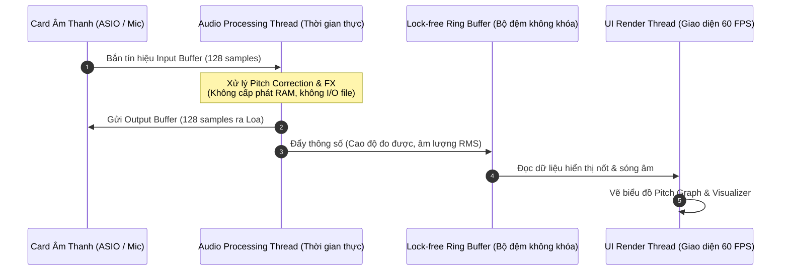

# 03. Kiến Trúc Phần Mềm & Lựa Chọn Công Nghệ (Software Architecture)

Tài liệu này định hình kiến trúc phần mềm cho ứng dụng KaraTune, phân tích các ngăn xếp công nghệ (Tech Stacks) và thiết kế hệ thống đa luồng đảm bảo âm thanh không bị giật lag (glitch-free audio).

---

## 1. Mô hình đa luồng thời gian thực (Real-time Threading Model)

Trong phát triển phần mềm âm thanh chuyên nghiệp, quy tắc số một là: **Luồng âm thanh (Audio Callback Thread) không bao giờ được phép bị chặn (Never block the audio thread).**



### Nguyên tắc sống còn cho Audio Thread:
1. **Không cấp phát bộ nhớ động (`malloc`, `new`):** Toàn bộ mảng bộ đệm, delay lines, FFT buffer phải được cấp phát sẵn lúc khởi động app.
2. **Không dùng khóa đồng bộ (`mutex`, `lock`):** Khóa có thể gây hiện tượng "nghẽn luồng" (priority inversion), làm giật tiếng. Dùng cấu trúc hàng đợi vòng **Lock-Free Ring Buffer (SPSC FIFO)**.
3. **Không ghi file hay gọi API mạng:** Tất cả tác vụ I/O được đẩy sang luồng nền (Background Worker Thread).

---

## 2. So sánh và lựa chọn công nghệ phát triển

| Tiêu chí | Phương án 1: C++ & JUCE Framework ⭐ (Khuyên dùng) | Phương án 2: Python (Prototype / PoC) | Phương án 3: Rust & CPAL / Nih-plug |
|:---|:---|:---|:---|
| **Mục đích** | **Xây dựng ứng dụng chính thức hoàn thiện** | **Thử nghiệm ý tưởng nhanh (trong 1-2 ngày)** | Hiện đại, an toàn bộ nhớ cao |
| **Độ trễ (Latency)** | Cực thấp (< 5ms), tận dụng tối đa tập lệnh SIMD/AVX2 của CPU Nitro 5 | Trung bình - Khá (10 - 20ms) | Cực thấp (< 5ms) |
| **Hỗ trợ Driver ASIO** | Hỗ trợ Native 100% qua JUCE Audio Device Manager | Cần cài đặt `pyaudio` hoặc `sounddevice` với wrapper ASIO | Cần cấu hình CPAL ASIO feature |
| **Hệ sinh thái DSP** | Hàng nghìn thư viện DSP chuẩn VST3 thương mại | Rất phong phú (`numpy`, `scipy`, `aubio`, `librosa`) | Đang phát triển nhanh |
| **Giao diện người dùng** | Tích hợp sẵn JUCE GUI hoặc nhúng Webview/React | PyQt6, Tkinter, DearPyGui | Slint, Iced, egui |

### Khuyến nghị lộ trình kỹ thuật:
- **Giai đoạn 1 (Fast PoC):** Dùng **Python** kết hợp thư viện `sounddevice` + `aubio` (hoặc `pedalboard` của Spotify) để tạo kịch bản nhận âm thanh từ mic và test chất âm AutoTune ra loa karaoke trong vòng 30 phút.
- **Giai đoạn 2 (Production App):** Dùng **C++ với JUCE Framework** để đóng gói thành file `.exe` độc lập có giao diện đẹp, chạy mượt mà trên Windows.

---

## 3. Kiến trúc module của KaraTune (Modular Decomposition)

```
KaraTune_App/
│
├── 📁 AudioEngine/             # Trái tim quản lý I/O âm thanh
│   ├── AudioDeviceManager      # Kết nối ASIO4ALL, Realtek WASAPI, chọn cổng Mic/Loa
│   ├── LatencyMonitor          # Đo đạc và cảnh báo độ trễ thời gian thực
│   └── Mixer                   # Trộn âm lượng Micro với nhạc Beat karaoke
│
├── 📁 DSPCore/                 # Bộ não xử lý tín hiệu số
│   ├── PitchDetector           # Thuật toán YIN / MPM trích xuất f0
│   ├── MusicalScale            # Bảng nốt, nhận diện tông Trưởng/Thứ/Ngũ cung
│   ├── PitchShifter            # Bộ dịch chuyển cao độ thời gian thực (PSOLA)
│   ├── FormantFilter           # Giữ nguyên âm sắc giọng tự nhiên
│   └── KaraokeEffects/         # Chuỗi hiệu ứng đi kèm
│       ├── NoiseGate           # Chống ồn và cắt xì phòng
│       ├── VocalCompressor     # Ổn định độ to nhỏ giọng hát
│       ├── ParametricEQ        # Làm sáng, dày tiếng hát
│       ├── StereoEchoDelay     # Hiệu ứng nhại karaoke quen thuộc
│       └── PlateReverb         # Độ vang phòng thu chuyên nghiệp
│
├── 📁 UI_Presentation/         # Giao diện hiển thị người dùng
│   ├── PitchVisualizer         # Vẽ đồ thị đường uốn cao độ (tương tự Melodyne/AutoTune)
│   ├── ScaleSelector           # Bảng chọn Key: C, D, E, F, G, A, B và Scale
│   ├── FXControlPanel          # Các nút vặn (Knobs) chỉnh Reverb, Echo, Retune Speed
│   └── PresetManager           # Lưu cấu hình: "Hát Bolero", "Hát Ballad", "Trap Autotune"
│
└── 📁 BeatPlayer/              # Module phát nhạc nền (Tùy chọn)
    ├── YoutubeAudioStreamer    # Lấy tiếng từ Youtube hoặc nhận Audio Loopback
    └── LocalFileAudioPlayer    # Mở file MP3/WAV karaoke tách lời
```

---

## 4. Cơ chế đồng bộ nhạc Beat và Micro (Mixer & Routing)

Để hát karaoke, phần mềm cần phát nhạc nền (Beat) đồng thời với tiếng Micro đã AutoTune:

1. **Phương án 1 (Phần mềm tự phát Beat):**
   - Tích hợp một máy nghe nhạc nội bộ cho phép kéo thả file `.mp3` hoặc link Youtube vào app.
   - Luồng phát nhạc đọc file MP3 -> Giải mã PCM -> Gửi thẳng tới Mixer mà không đi qua bộ lọc AutoTune.
   - Micro đi qua chuỗi AutoTune -> Gửi tới Mixer.
   - Hai luồng được cộng với nhau (`Output = Alpha * Beat + Beta * Vocal`) trước khi xuất ra loa.
2. **Phương án 2 (Bắt âm thanh từ trình duyệt/Youtube qua Virtual Cable):**
   - Sử dụng **VB-Audio Virtual Cable** hoặc **WASAPI Loopback Capture**.
   - Người dùng mở bài hát trên Youtube bằng trình duyệt Edge/Chrome bình thường.
   - Ứng dụng KaraTune thu lại âm thanh hệ thống, hòa trộn với tiếng Micro đã xử lý rồi xuất ra loa karaoke.
