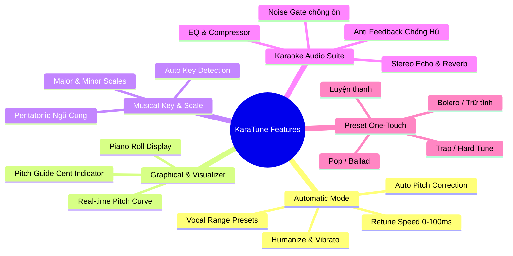

# 04. Đặc Tả Chi Tiết Tính Năng Ứng Dụng (Feature Specifications)

Tài liệu này chi tiết hóa các tính năng nghiệp vụ của phần mềm AutoTune Karaoke, bám sát các yêu cầu từ bài toán thực tế và mô hình sản phẩm chuyên nghiệp.

---

## 1. Bảng tóm tắt các tính năng cốt lõi

---

## 2. Chi tiết từng tính năng

### 2.1. Chế độ Tự Động (Automatic Mode) - Cốt lõi
*Tính năng quan trọng nhất cho người hát karaoke gia đình.*

- **Chỉnh sửa cao độ tự động (Real-time Auto Pitch Correction):**
  - Hệ thống liên tục phân tích tín hiệu giọng hát từ micro dây.
  - Khi giọng hát lệch khỏi nốt chuẩn trong thang âm đã chọn, phần mềm tự động tính toán sai số (tính bằng đơn vị Cent: 1 nửa cung = 100 cent) và dịch chuyển tần số về nốt chuẩn.
- **Tùy chỉnh tốc độ bẻ nốt (Retune Speed Knob):**
  - **0 - 5ms (Robotic Style):** Hiệu ứng AutoTune gắt gao kiểu T-Pain, Travis Scott, Jack, Sơn Tùng M-TP. Nốt nhảy bậc cơ học cực mạnh.
  - **15 - 35ms (Pop/Modern):** Chuẩn cho các bài nhạc trẻ, giọng sáng, nốt chắc nịch nhưng vẫn giữ được cảm xúc.
  - **40 - 80ms (Natural/Bolero):** Chỉnh rất nhẹ nhàng, chỉ hỗ trợ khi bị hụt hơi ở cuối câu, giữ nguyên 100% các đoạn ngân rung cổ họng.
- **Lựa chọn quãng giọng (Vocal Range Selector):**
  - Giúp thuật toán thu hẹp phạm vi quét tần số, loại trừ nhiễu:
    - `Nam trầm (Low Male / Bass - Baritone)`: Quét từ 65Hz - 260Hz.
    - `Nam cao (Tenor) / Nữ trầm (Alto)`: Quét từ 130Hz - 500Hz.
    - `Nữ cao (Soprano)`: Quét từ 250Hz - 1050Hz.

---

### 2.2. Chế độ Đồ họa & Gợi ý nốt (Graphical Mode & Pitch Guide)
*Giúp người hát nhìn thấy giọng của mình trực quan trên màn hình.*

- **Đồ thị cao độ thời gian thực (Real-time Pitch Curve):**
  - Một dải cuộn ngang hiển thị các phím đàn Piano (từ C2 đến C6).
  - Giọng hát thực tế hiển thị dưới dạng **đường cong màu cam/đỏ**.
  - Nốt nhạc chuẩn trong bài hiển thị dưới dạng **thanh thước màu xanh lá/cyan**.
- **Đồng hồ đo sai lệch cao độ (Pitch Deviation Meter / Tuner):**
  - Hiển thị kim đo: Nếu hát quá thấp (Flat) kim lệch sang trái (-30 cents), nếu hát quá cao (Sharp) kim lệch sang phải (+20 cents).
  - Khi hát trúng nốt, kim chuyển sang màu xanh dương rực rỡ và phát hiệu ứng ánh sáng.
- **Chế độ Hướng dẫn tập hát (Singing Practice Mode):**
  - Người dùng có thể tắt chức năng bẻ nốt để tự mình luyện giọng. Phần mềm sẽ chấm điểm tỉ lệ % bạn hát trúng nốt theo giai điệu.

---

### 2.3. Quản lý Thang âm & Tông bài hát (Key & Scale Engine)

- **Chọn Key thủ công:**
  - Danh sách 12 nốt gốc: `C, C#, D, D#, E, F, F#, G, G#, A, A#, B`.
  - Các loại thang âm phổ biến:
    - **Major (Trưởng):** Phù hợp nhạc vui tươi, Pop, thiếu nhi.
    - **Minor (Thứ):** Phù hợp nhạc buồn, Ballad, Bolero.
    - **Pentatonic (Ngũ cung Việt Nam/Á Đông):** Cực kỳ thích hợp cho các bài dân ca, quê hương, cải lương.
    - **Chromatic (Bán âm):** Chỉnh mọi nốt mà không giới hạn tông bài hát.
- **Tự động nhận diện Tông (Auto-Key Detection):**
  - Phần mềm lắng nghe đoạn nhạc dạo (Intro) của Beat karaoke trong 5 - 10 giây đầu tiên.
  - Dùng thuật toán Chromagram / Chroma Features để tự động đoán tông của bài hát và tự đổi thang âm tương ứng.

---

### 2.4. Gói hiệu ứng Karaoke chuyên nghiệp (All-in-One Karaoke Suite)

Người hát không cần phải chỉnh nhiều thiết bị rời rạc trên amply hay vang cơ:

1. **Anti-Feedback (Chống hú thông minh):**
   - Bộ dò quét tần số tự động cắt gọt các đỉnh cộng hưởng phòng, giúp người dùng mở loa to mà không sợ rít mic chói tai.
2. **Karaoke Echo (Hiệu ứng nhại):**
   - Điều chỉnh độ lặp (Repeat) và độ trễ (Delay time) để giọng hát bay bổng, người hát nghiệp dư không bị cảm giác "hụt hơi, khô tiếng".
3. **Studio Reverb (Không gian phòng thu):**
   - Đem lại độ vang sâu lắng, hòa giọng hát quyện vào nhạc beat Youtube.
4. **Microphone De-esser & Brightness:**
   - Lọc bỏ các âm xì chát chúa khi phát âm các từ có chữ "s", "x", "ch". Tăng độ sáng ấm cho mic dây.

---

### 2.5. Các Preset một chạm (One-Touch Presets)

Thiết kế sẵn 4 nút bấm to, thân thiện cho mọi đối tượng trong gia đình:

| Tên Preset | Retune Speed | Vocal Range | Echo / Reverb | Đối tượng bài hát phù hợp |
|:---|:---:|:---:|:---:|:---|
| **Bolero Ngọt Ngào** | 50ms | Nam/Nữ trung | Echo 40%, Reverb 30% | Dòng nhạc trữ tình, Bolero, tiền chiến, cần độ luyến láy mộc mạc. |
| **Pop Ballad Phòng Thu**| 25ms | Đa dụng | Echo 20%, Reverb 45% | Các bài hit nhạc trẻ, ballad nhẹ nhàng, giọng rõ và dày. |
| **GenZ AutoTune (Trap/Club)** | 0ms | Tùy chọn | Echo 15%, Reverb 50% | Nhạc Rap, Hiphop, Remix sôi động, hiệu ứng méo giọng điện tử rõ rệt. |
| **Mộc Mạc / Karaoke Mộc** | Bypass | Tự do | Echo 30%, Reverb 25% | Tắt hoàn toàn AutoTune, chỉ dùng hiệu ứng vang để hát thật 100%. |
