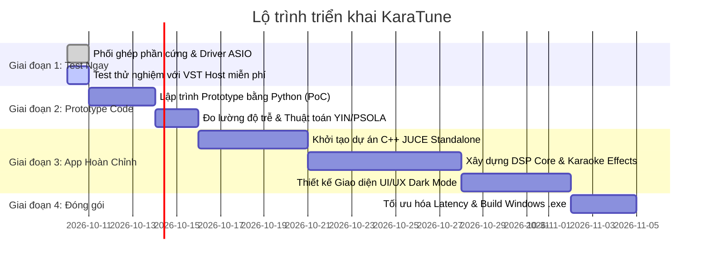

# 05. Lộ Trình Phát Triển & Kế Hoạch Triển Khai (Development Roadmap)

Tài liệu này cung cấp kế hoạch từng bước rõ ràng để bạn có thể **hát thử nghiệm ngay trong hôm nay**, đồng thời có lộ trình lập trình tự phát triển phần mềm mang thương hiệu riêng của bạn.

---

## 1. Các giai đoạn phát triển (Milestones)

---

## 2. Chi tiết từng giai đoạn

### GIAI ĐOẠN 1: Hát Thử Nghiệm Ngay Lập Tức (Không cần chờ code)
*Mục tiêu: Đánh giá chất âm của bộ mic và loa karaoke hiện có xem có đạt chuẩn không.*

1. **Chuẩn bị kết nối:**
   - Cắm Mic dây qua đầu chuyển vào Nitro 5 (dùng cáp gộp tai nghe/mic Y-Splitter).
   - Nối dây 3.5mm AUX từ cổng ra loa của Nitro 5 vào Loa Karaoke.
2. **Cài đặt Driver:**
   - Tải và cài đặt **ASIO4ALL v2**.
3. **Cài đặt Host & Plugin AutoTune miễn phí:**
   - Cài đặt phần mềm host siêu nhẹ: **Reaper** hoặc **Cantabile Lite** (miễn phí).
   - Tải VST AutoTune miễn phí chất lượng cao:
     - **Auburn Sounds - Graillon 2** (Bản Free có Pitch Shifter và Pitch Correction real-time rất mượt).
     - **MeldaProduction - MAutoPitch** (Hoàn toàn miễn phí, có Formant Shifting và Scale Detection).
4. **Trải nghiệm:**
   - Mở nhạc Youtube trên trình duyệt -> Bật Graillon 2 trong Reaper -> Bắt đầu hát thử để kiểm tra độ trễ và chất giọng.

---

### GIAI ĐOẠN 2: Lập Trình Bản Thử Nghiệm Bằng Python (Proof of Concept - PoC)
*Mục tiêu: Tự kiểm soát mã nguồn thuật toán phát hiện và bẻ nốt.*

- **Thư viện sử dụng:**
  - `sounddevice`: Bắt và phát luồng âm thanh theo dạng khối mẫu (Chunks/Frames) qua giao thức WASAPI hoặc ASIO.
  - `aubio` hoặc `librosa`: Thư viện xử lý cao độ thời gian thực (Pitch Detection).
  - `pedalboard` (Thư viện DSP mã nguồn mở của Spotify): Hỗ trợ chuỗi hiệu ứng Guitar, Reverb, Delay, Chorus, Compressor và nạp VST3 cực kỳ mạnh mẽ chỉ với vài dòng code Python.
- **Kết quả nghiệm thu:**
  - Chạy một script Python `python test_autotune.py`.
  - Nói vào micro và nghe thấy tiếng mình phát ra loa với cao độ đã bị bẻ theo thang âm C Major.

---

### GIAI ĐOẠN 3: Phát Triển Phần Mềm Chính Thức Bằng C++ & JUCE Framework
*Mục tiêu: Xây dựng ứng dụng Standalone có hiệu năng cực cao, độ trễ < 5ms, giao diện đẹp.*

- **Công cụ:**
  - Visual Studio 2022 Community (C++ Desktop Development).
  - JUCE Framework (v7 hoặc v8).
  - Projucer hoặc CMake để quản lý build.
- **Các bước lập trình:**
  1. Tạo ứng dụng kiểu **JUCE Standalone Application**.
  2. Triển khai lớp `juce::AudioIODeviceCallback` để nhận buffer đầu vào và trả buffer đầu ra.
  3. Lập trình thuật toán **McLeod Pitch Method (MPM)** trong luồng audio.
  4. Lập trình bộ biến đổi cao độ **Time-Domain Pitch Synchronous Overlap-Add (TD-PSOLA)**.
  5. Ghép nối module `juce::dsp::Reverb`, `juce::dsp::Compressor`, `juce::dsp::IIR::Filter`.
  6. Thiết kế giao diện đồ họa GUI:
     - Dùng các thanh Slider xoay tròn (Rotary Knobs) cho Echo, Reverb, Tone, Retune Speed.
     - Dùng OpenGL Component hoặc JUCE Graphics để vẽ dải sóng âm thanh và biểu đồ nốt nhạc chuyển động thời gian thực.

---

### GIAI ĐOẠN 4: Đóng Gói Sản Phẩm & Triển Khai Thực Tế

1. **Tối ưu hóa mã nhị phân:**
   - Bật cờ tối ưu hóa biên dịch: `/O2`, `/AVX2` (tận dụng phần cứng CPU Nitro 5).
   - Giảm thiểu việc sao chép mảng dữ liệu (Zero-copy DSP buffers).
2. **Tạo bộ cài đặt Installer:**
   - Dùng **Inno Setup** để đóng gói toàn bộ ứng dụng thành 1 file duy nhất `KaraTune_Setup.exe`.
   - Tự động quét và kích hoạt driver ASIO khi người dùng mở phần mềm lần đầu.
3. **Tính năng bổ trợ:**
   - Tích hợp phím tắt nhanh trên bàn phím laptop Nitro 5 (ví dụ: Phím mũi tên lên/xuống để đổi tông bài hát trực tiếp khi đang hát).
