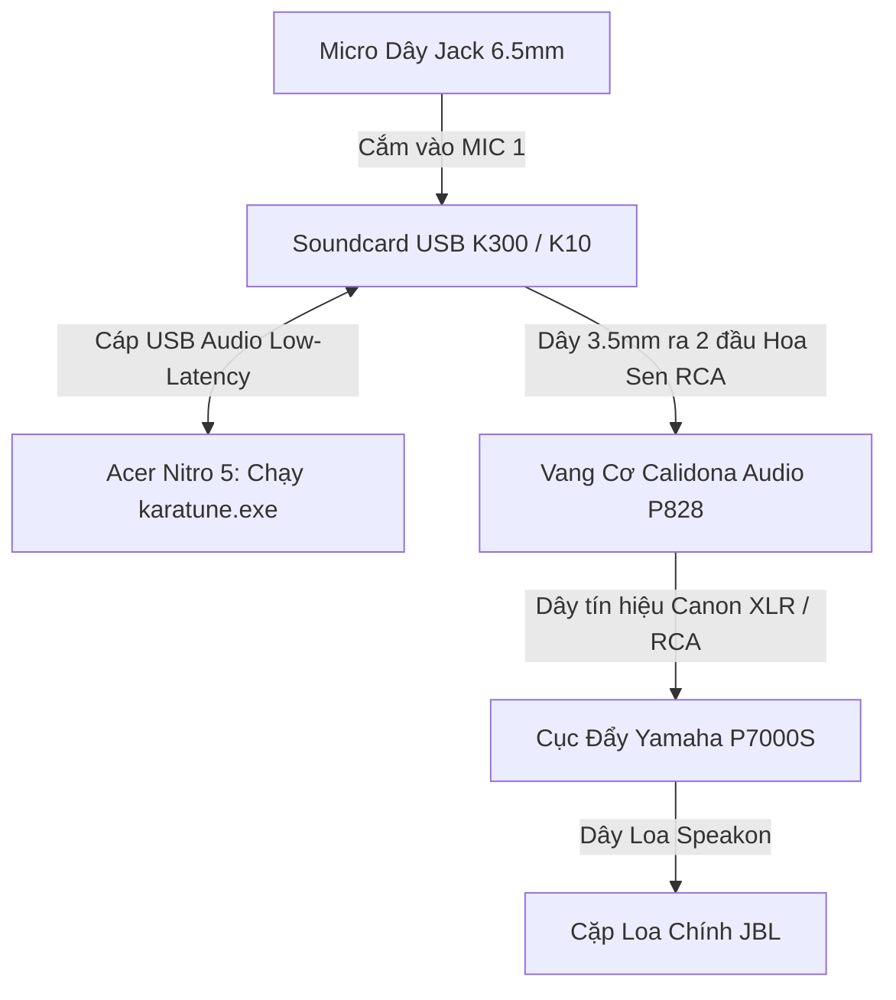

# Dự Án Phần Mềm AutoTune Karaoke Cho Gia Đình (KaraTune)

Tài liệu tổng hợp thiết kế, kiến trúc kỹ thuật và giải pháp triển khai phần mềm **AutoTune Karaoke** thời gian thực (Real-time Pitch Correction) dành cho máy tính cá nhân (Acer Nitro 5) kết hợp với dàn âm thanh gia đình thực tế: **Vang cơ Calidona P828, Cục đẩy Yamaha P7000S và Cặp loa JBL**.

---

## 1. Giới thiệu dự án

Hát karaoke tại nhà là nhu cầu giải trí rất phổ biến, tuy nhiên phần lớn người hát nghiệp dư thường gặp các vấn đề:
- Hát chênh, phô, hụt hơi hoặc không lên tới các nốt cao.
- Không giữ được đúng cao độ (pitch) theo giai điệu bài hát.
- Giọng mộc thiếu độ mượt mà, độ vang hoặc màu sắc hiện đại (như hiệu ứng Auto-Tune của các ca sĩ trẻ/rapper).

**Mục tiêu của dự án:** Xây dựng một phần mềm AutoTune gọn nhẹ bằng **C++ Native**, độ trễ cực thấp (< 5.3ms), cho phép người dùng cắm micro và xuất âm thanh ra dàn âm thanh gia đình (Vang cơ Calidona, Cục đẩy Yamaha, Loa JBL) để hát trực tiếp với giọng đã được hiệu chỉnh chuẩn cao độ và thêm các hiệu ứng âm thanh chuyên nghiệp (Reverb, Echo, Compressor).

---

## 2. Mục lục tài liệu kỹ thuật

| STT | Tài liệu | Nội dung chính |
|:---:|:---|:---|
| 01 | [01_HARDWARE_AND_AUDIO_IO.md](file:///g:/Project/AutoTune/docs/01_HARDWARE_AND_AUDIO_IO.md) | **[CẬP NHẬT]** Hướng dẫn đấu nối dàn máy thực tế (Vang Calidona P828 + Đẩy Yamaha P7000S + Loa JBL), danh sách phụ kiện cần mua và link đặt hàng Shopee. |
| 02 | [02_CORE_DSP_PIPELINE.md](file:///g:/Project/AutoTune/docs/02_CORE_DSP_PIPELINE.md) | Chi tiết chuỗi xử lý tín hiệu số (DSP): Pitch Detection (YIN/MPM), Quantization, Pitch Shifting (PSOLA/Phase Vocoder), Reverb/Delay. |
| 03 | [03_SOFTWARE_ARCHITECTURE.md](file:///g:/Project/AutoTune/docs/03_SOFTWARE_ARCHITECTURE.md) | Kiến trúc phần mềm: Đa luồng (Audio Thread vs UI Thread), Engine C++ Native miniaudio vs Python Prototype. |
| 04 | [04_FEATURES_SPEC.md](file:///g:/Project/AutoTune/docs/04_FEATURES_SPEC.md) | Đặc tả tính năng: Chế độ Tự động (Auto Mode), Gợi ý nốt (Pitch Guide), Quản lý Scale/Key, Hiệu ứng T-Pain và Giao diện UI/UX. |
| 05 | [05_DEVELOPMENT_ROADMAP.md](file:///g:/Project/AutoTune/docs/05_DEVELOPMENT_ROADMAP.md) | Kế hoạch triển khai từng bước: Từ thử nghiệm bằng Python đến đóng gói phần mềm thành phẩm C++/JUCE. |
| 06 | [06_QUICK_START_PROTOTYPE.md](file:///g:/Project/AutoTune/docs/06_QUICK_START_PROTOTYPE.md) | Phân tích bài toán âm học thực tế (AEC Ducking, Granular Flutter) và hướng dẫn chạy kiểm định. |

---

## 3. Sơ đồ hệ thống phần cứng gia đình thực tế

