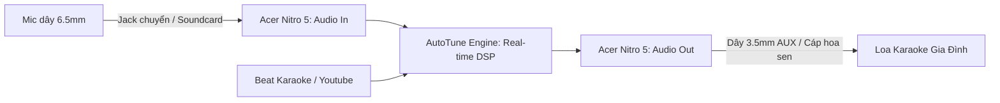

# Dự Án Phần Mềm AutoTune Karaoke Cho Gia Đình (KaraTune)

Tài liệu tổng hợp thiết kế, kiến trúc kỹ thuật và giải pháp triển khai phần mềm **AutoTune Karaoke** thời gian thực (Real-time Pitch Correction) dành cho máy tính cá nhân (Acer Nitro 5) kết hợp với dàn âm thanh gia đình.

---

## 1. Giới thiệu dự án

Hát karaoke tại nhà là nhu cầu giải trí rất phổ biến, tuy nhiên phần lớn người hát nghiệp dư thường gặp các vấn đề:
- Hát chênh, phô, hụt hơi hoặc không lên tới các nốt cao.
- Không giữ được đúng cao độ (pitch) theo giai điệu bài hát.
- Giọng mộc thiếu độ mượt mà, độ vang hoặc màu sắc hiện đại (như hiệu ứng Auto-Tune của các ca sĩ trẻ/rapper).

**Mục tiêu của dự án:** Xây dựng một phần mềm AutoTune gọn nhẹ, độ trễ cực thấp (Low Latency < 15ms), cho phép người dùng cắm micro và xuất âm thanh ra loa karaoke để hát trực tiếp với giọng đã được hiệu chỉnh chuẩn cao độ và thêm các hiệu ứng âm thanh chuyên nghiệp (Reverb, Echo, Compressor).

---

## 2. Mục lục tài liệu

| STT | Tài liệu | Nội dung chính |
|:---:|:---|:---|
| 01 | [01_HARDWARE_AND_AUDIO_IO.md](file:///g:/Project/AutoTune/docs/01_HARDWARE_AND_AUDIO_IO.md) | Phân tích phần cứng hiện có (Nitro 5, Mic dây, Loa), cách phối ghép, giải quyết bài toán độ trễ (Latency) và chống hú rít. |
| 02 | [02_CORE_DSP_PIPELINE.md](file:///g:/Project/AutoTune/docs/02_CORE_DSP_PIPELINE.md) | Chi tiết chuỗi xử lý tín hiệu số (DSP): Pitch Detection (YIN/MPM), Quantization, Pitch Shifting (PSOLA/Phase Vocoder), Reverb/Delay. |
| 03 | [03_SOFTWARE_ARCHITECTURE.md](file:///g:/Project/AutoTune/docs/03_SOFTWARE_ARCHITECTURE.md) | Kiến trúc phần mềm: Đa luồng (Audio Thread vs UI Thread), chọn nền tảng (C++ JUCE vs Python Prototype), mô hình Standalone vs VST. |
| 04 | [04_FEATURES_SPEC.md](file:///g:/Project/AutoTune/docs/04_FEATURES_SPEC.md) | Đặc tả tính năng: Chế độ Tự động (Auto Mode), Gợi ý nốt (Pitch Guide), Quản lý Scale/Key, Hiệu ứng T-Pain và Giao diện UI/UX. |
| 05 | [05_DEVELOPMENT_ROADMAP.md](file:///g:/Project/AutoTune/docs/05_DEVELOPMENT_ROADMAP.md) | Kế hoạch triển khai từng bước: Từ thử nghiệm bằng Python/DAW đến đóng gói phần mềm thành phẩm C++/JUCE. |

---

## 3. Tổng quan hệ thống phần cứng & kết nối

---

## 4. Các thách thức kỹ thuật then chốt

1. **Độ trễ âm thanh (Real-time Latency):**
   - Khi hát trực tiếp, nếu độ trễ âm thanh giữa lúc phát âm vào micro đến khi tiếng phát ra loa **vượt quá 15 - 20ms**, người hát sẽ bị hiện tượng "nói lắp", dội âm (comb filtering) gây chóng mặt và không thể hát được.
   - Bắt buộc phải sử dụng trình điều khiển **ASIO (hoặc ASIO4ALL)** hoặc **WASAPI Exclusive** trên Windows.
2. **Thuật toán nhận diện và bẻ nốt (Pitch Shifting):**
   - Phải phát hiện đúng cao độ cơ bản ($f_0$) của giọng hát trong vòng 5-10ms mà không bị nhầm lẫn bởi âm bồi (harmonics).
   - Dịch chuyển cao độ mượt mà, giữ nguyên formant (âm sắc giọng người) để không bị biến giọng thành tiếng hoạt hình (trừ khi cố tình bật hiệu ứng T-Pain).
3. **Chống rú rít (Feedback Suppression):**
   - Không gian phòng khách gia đình có phản xạ âm lớn; mic bắt lại tiếng từ loa dễ gây hú rít tần số cao. Cần bổ sung Noise Gate và bộ lọc cắt tần số hú (Notch Filter).
